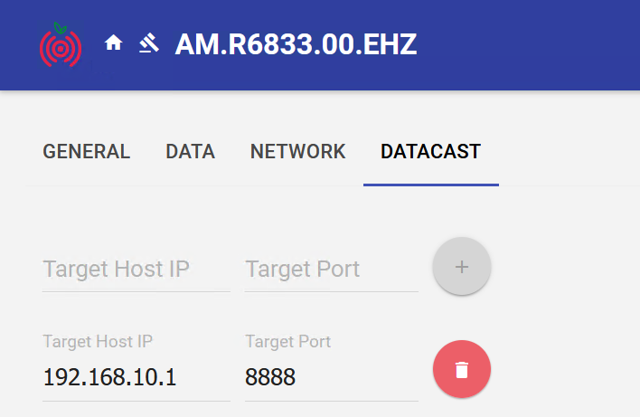
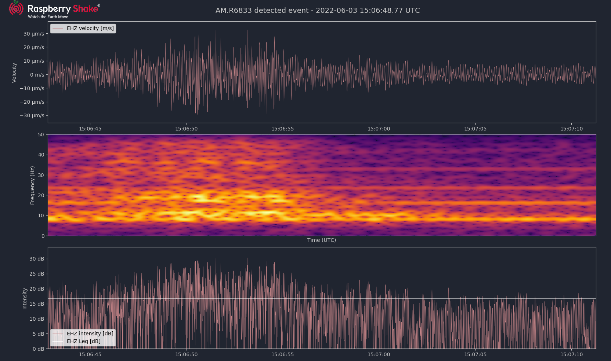
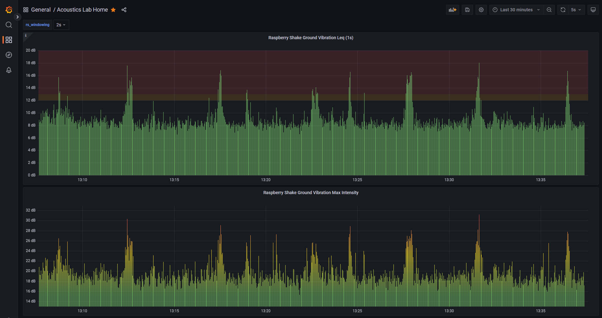

# Rsudp-Leq
This is an extended version of [rsudp](https://github.com/raspishake/rsudp) with only the relevant modules and dependencies for the use case of small ground vibration disturbance detection, ready for production deployment. Tested and deployed for Windows 10. Some dependencies from the original [rsudp](https://github.com/raspishake/rsudp) software were removed due to causing issues and/or not working at all on Windows 10.

## About:

- :star: Main goal: small disturbance detection, i.e. trigger alarm on trains nearby, construction work, etc. that might disturb measurements in acoustically controlled environments. 
- :new: Plot module from [rsudp](https://github.com/raspishake/rsudp) extended to plot intensity and equivalent continuous sound level (Leq).
- :new: New alarm module (c_alarm_leq_iir.py) that uses trigger mechanism based on Equivalent Sound-Pressure Level (Leq): short-term vs long-term or static Leq.
- :new: Write module from [rsudp](https://github.com/raspishake/rsudp) extended to periodically push Leq and maximum intensity levels [dB] (over 1s time-periods) to influxDB Time-series database for historical data visualization.
- :white_check_mark: Coded and tested only for RS1D / 1 channel geophone.

## Table of Contents  
- [Instructions](#instructions) 
- [Configuration File Parameters](#configuration-file-parameters)
- [Database storage and visualization](#database-storage-and-visualization)

# Instructions
### How to install:
- Clone this repo
- Run the [installation script](win-install-rsudp.bat) by double-clicking it.

### How to start the program:
- Run the [start script](win-start-rsudp.bat) by double-clicking it.
- Suggestion: create a shortcut to this file that can be run from everywhere (e.g. the Desktop)

# Configuration File Parameters
A configuration file is automatically placed in the **C:\users\\%USERNAME%\\.config\rsudp** folder by the install script. An [example config file](config_file_sample.json) is also available in this repo. You will probably need to change the location of the inventory file and desired output directory.

## settings:
- **port**: UDP port where the program listens for packets. The port is specified on the raspberry shake Admin Webpage toghether with the destination IP Address:  
        
  
- **station**: OFFLN  --> use offline inventory file (in inventory_files folder).
- **scaling_sensitivity**: sensitivity of the geophone. This parameter is used to compute velocity [$m/s$] from the AD-converter voltage counts. It is only used in modules where the *scaling* option is set to true. Default value: 250000000 [$counts/(m/s)$].
- **db_reference**: reference velocity value to compute dB intensity. Default value: 1 $\mu m/s$ (1e-6).
- **debug**: if true send text to command line. Default: true (recommended).

## plot:
This is the standard live plotting module from rsudp extended to enable displaying of intensity(dB) as well as Leq(dB) values.

- **duration**: Inverval in seconds for the live plot. Default 60s.
- **spectrogram**: show spectrogram of the signal. Default: true.
- **decibel**: adds live intensity (dB) plot with Leq average. Default: true.
- **voltage**: shows live voltage estimation. Default: false.
- **fullscreen**: fullscreen window mode. Default: true
- **kiosk**: fullscreen + force the plot to fill the entire screen (used for showing continuously in monitoring display). Default: false.
- **event_screenshot**: produce a screenshot of the waveforms/spectrogram when an alert is triggered (e.g. by the alert_leq_IIR module). Default: true.
- **scaling**: compute velocity using the *scaling_sensitivity* parameter. If disabled the plot shows voltage counts from the AD converter (then of course alse the db_reference parameter needs to be adjusted to a value that makes sense). Default: true.

## alert_leq_IIR:
This module triggers an alarm when the short-term Leq (Equivalent Noise Level) value goes above a certain treshold. The alert trigger is implemented with the STA/LTA method. Unlike the main alert module in rsudp, thie module uses an IIR filter to compute the STA and LTA Leq values, hence it doesn't require storing all the samples in the buffer. This allows to have longer LTA intervals while running without issue on light hardware (e.g. Raspberry Pi). Also it doesn't require a "warmup" time before the trigger is activated. The module also supports a static value for the LTA Leq, if setting a static treshold is desired.

IIR first order filter:

    y[n+1] = a * y[n] + (1-a) * x[n+1]
    
    a <-- "remembering" factor (lower = filter forgets old values easily)
    a ~ 10 ^ ( filter_loss[dB] / (20 * T * fs) )

- **a_sta**: "remembering" factor for the IIR filter for the STA calculation.
- **a_lta**: "remembering" factor for the IIR filter for the LTA calculation.
- **static_lta**: use a static value for the LTA instead of an Leq calculation (this is the preferred method, as varying LTA would contain also high noise events in the calculation). Default: true.
- **lta**: Value for LTA if *static_lta* is set to true. Default 10dB (computed with 1 $\mu m/s$ (1e-6) dB reference).
- **scaling**: compute velocity using the *scaling_sensitivity* parameter. If disabled the calculations are performed using voltage counts from the AD converter (then of course alse the db_reference and lta parameters needs to be adjusted to values that makes sense). Default: true.

## write:
This module can be used to write raw data (voltage counts from A/D converter) to a csv file on the local disk and/or to push data periodically (at 1s intervals) to a database (influxDB). Every second the module pushes Leq values (computed over a 1s interval), as well as the maximum recorded intensity value (again measured on a 1s interval).

- **csv_output**: write raw data to local file in the output_dir. Default: false.
- **database_push**: push data to an influxDB bucket at intervals of 1s. Default: true.
- **database_URL**: database URL. Default: http://localhost:8086 (influxdB default port).
- **database_BUCKET**: influxDB bucket name (bucket needs to be created manually on the database). Default: rsudp.
- **database_TOKEN**: influxDB API token with write access to the database_BUCKET.
- **scaling**: compute velocity using the *scaling_sensitivity* parameter. If disabled the calculations are performed using voltage counts from the AD converter. Default: true.      

## forward:
The forward module can be used to forward raw-data and/or alarm messages to a remote machine. Alarm messages are forwarded in two cases: when an alarm is triggered (ALARM) or when the trigger is reset (RESET), meaning that the event is terminated.

- **address**: Forward destination IP Address.
- **port**: Forward destination port. Default: 8888.
- **fwd_data**: Forward full raw data-stream as it is received from the Raspberry Shake. Default: false. 
- **fwd_alarms**: Forward alarm messages (ALARM and RESET). Default: true.

The alarm packets generated are simple non-encrypted UDP packets with the following strings as payload:
- ALARM: <"current_date&time">
- RESET: <"current_date&time">

## printdata:
This module is used to print data directly to the command line as it arrives from the Raspberry shake (used only for debugging purposes).

# Database storage and visualization
If the **database_push** feature is enabled in the [write](#write) module, rsudp pushes metrics to a time-series database (influxDB). Refer to the README in the [visualization](visualization) folder for instruction on how to setup the database and visualization stack, add new influxdb buckets, grafana dashboards, etc..

Example:

